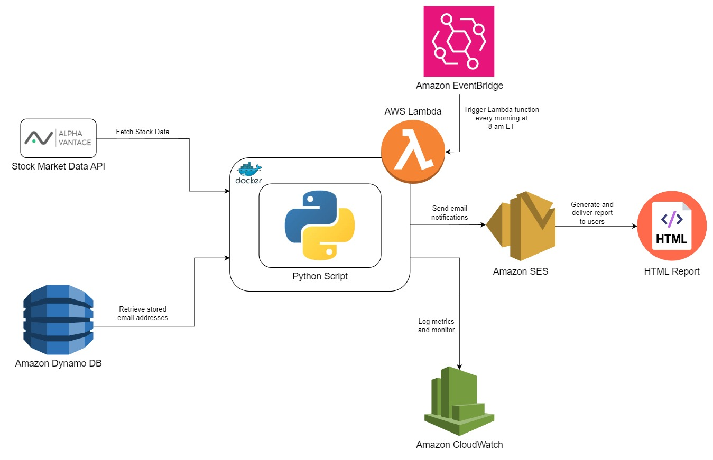

# Stock Market Analysis Report Automation

This project automates the process of retrieving stock market data, analyzing it, and sending the results to multiple recipients via email using AWS services.

## Architecture Overview

The architecture involves multiple AWS services such as Lambda, EventBridge, SES, DynamoDB, and CloudWatch. The stock data is retrieved from Alpha Vantage API, processed by a Python script, and sent via email using Amazon SES. The Python script is containerized using Docker and deployed to AWS Lambda.



## Components

- **Alpha Vantage API**: Retrieves stock market data.
- **Python Script**: Processes data, generates an HTML report, and sends it via email.
- **Docker & Amazon ECR**: Containerizes the Python script and stores it in ECR.
- **AWS Lambda**: Executes the Dockerized Python script as a Lambda function.
- **Amazon EventBridge**: Triggers the Lambda function every morning at 8 AM ET.
- **Amazon SES**: Sends HTML reports to recipients via email.
- **Amazon DynamoDB**: Stores recipients' email addresses.
- **Amazon CloudWatch**: Logs and monitors the execution of the Lambda function.

## Project Setup

### 1. Prerequisites

- **AWS Account**: For setting up AWS services like Lambda, DynamoDB, SES, EventBridge, and CloudWatch.
- **Alpha Vantage API Key**: To retrieve stock market data.
- **Docker Installed**: To containerize the Python script.

### 2. Clone the Repository

Clone this repository to your local machine using the following command:

```bash
git clone <repository-url>
